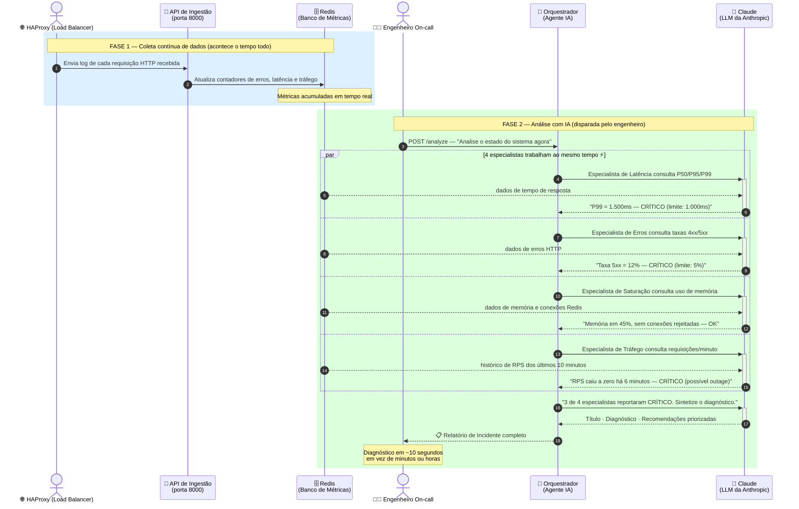
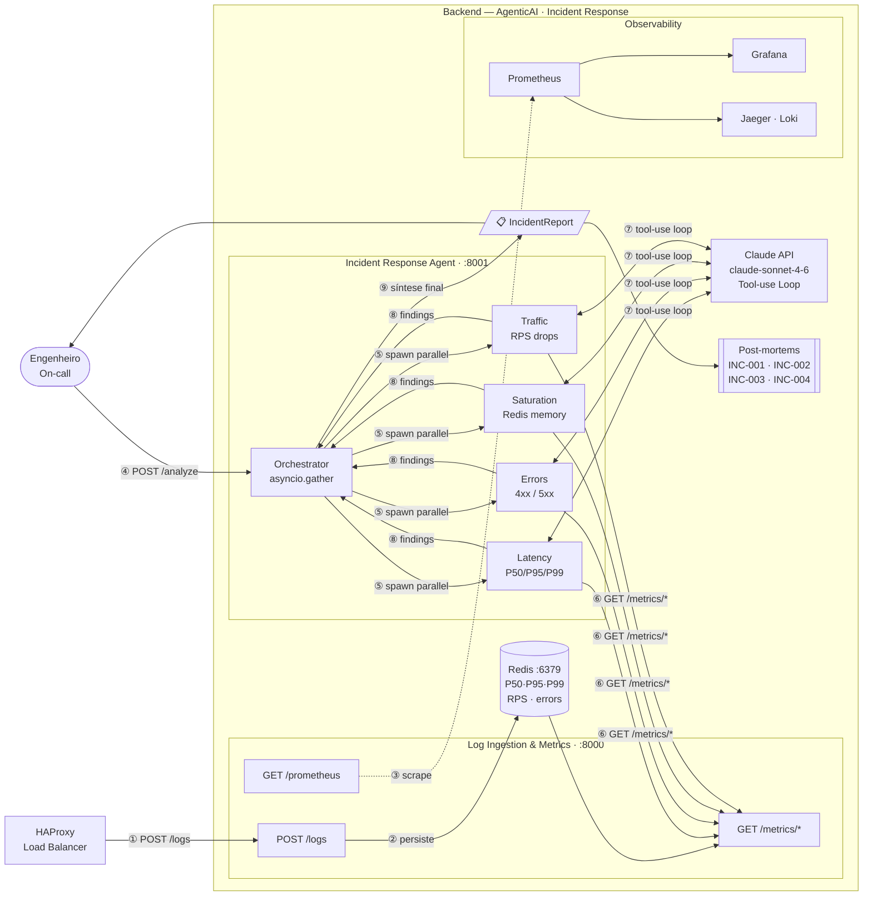
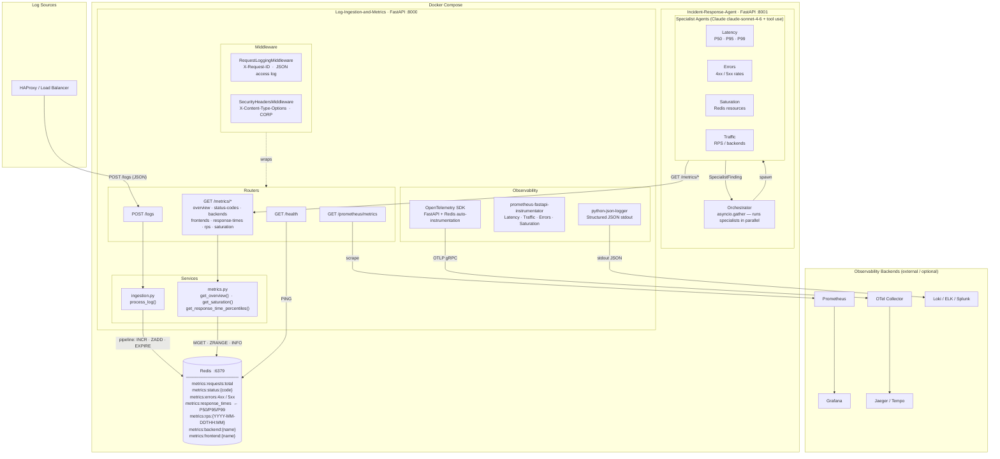

# AgenticAI-2-Incident-Response

Research project exploring **Agentic AI as a Copilot** for reducing **MTTD** (Mean Time to Detect) and **MTTR** (Mean Time to Recovery) in IT incident response — developed as part of a Master's dissertation at **PPGCA / Unisinos**.

---

## Como funciona — visão geral para não especialistas

O sistema tem dois momentos distintos: **coleta contínua de dados** e **análise sob demanda com IA**.



> **Resumo em uma frase:** o HAProxy alimenta a API com logs continuamente; quando o engenheiro dispara `/analyze`, quatro agentes especialistas consultam as métricas em paralelo, cada um pede ao Claude para interpretar os dados do seu domínio, e o orquestrador sintetiza tudo em um relatório com severidade, diagnóstico e ações recomendadas.

---

## Architecture

### System Overview



### Internal Architecture



### Four Golden Signals coverage

| Signal         | How it is measured                                                                                                         |
| -------------- | -------------------------------------------------------------------------------------------------------------------------- |
| **Latency**    | P50 / P95 / P99 via `GET /metrics/response-times` · Histogram at `GET /prometheus/metrics`                                 |
| **Traffic**    | RPS per minute via `GET /metrics/rps` · `http_requests_total` counter in Prometheus                                        |
| **Errors**     | Error counts + rates (%) via `GET /metrics/overview` · `http_requests_total{status="5xx"}` in Prometheus                   |
| **Saturation** | Redis memory, clients, rejected connections via `GET /metrics/saturation` · `http_requests_inprogress` gauge in Prometheus |

---

## Modules

### `Incident-Response-Agent`

Multi-agent AI copilot that analyzes the Four Golden Signals and produces a structured `IncidentReport` with diagnosis and remediation recommendations. Designed to reduce MTTD and MTTR for on-call engineers.

**Stack:** Python · FastAPI · Anthropic SDK · httpx

#### Multi-agent design

| Role                      | Description                                                                                                                              |
| ------------------------- | ---------------------------------------------------------------------------------------------------------------------------------------- |
| **Orchestrator**          | Runs all four specialist agents in parallel via `asyncio.gather`, then calls Claude once more to synthesize findings into a final report |
| **Latency Specialist**    | Calls `GET /metrics/response-times` · detects P95 > 500 ms (WARNING) or P99 > 1000 ms (CRITICAL)                                         |
| **Errors Specialist**     | Calls `GET /metrics/overview` + `GET /metrics/status-codes` · detects 5xx rate > 5 % (WARNING) or > 10 % (CRITICAL)                      |
| **Saturation Specialist** | Calls `GET /metrics/saturation` · detects Redis memory > 80 % or rejected connections > 0                                                |
| **Traffic Specialist**    | Calls `GET /metrics/rps` + `GET /metrics/backends` · detects RPS drops to 0 or unexpected traffic spikes                                 |

Each specialist runs a **Claude tool-use loop** (`claude-sonnet-4-6`): the model requests data via tool calls, receives the metrics JSON, and returns a structured `SpecialistFinding`.

#### API

| Method | Endpoint   | Description                           |
| ------ | ---------- | ------------------------------------- |
| `GET`  | `/health`  | Liveness check                        |
| `POST` | `/analyze` | Run a full multi-agent analysis cycle |

#### `POST /analyze` response schema

```json
{
  "timestamp": "2026-05-09T23:00:00Z",
  "overall_severity": "ok | warning | critical",
  "title": "High 5xx Error Rate on api-backend",
  "diagnosis": "The error specialist detected a 5xx rate of 12%...",
  "recommendations": [
    "Check api-backend application logs for stack traces",
    "Verify backend health check endpoints",
    "Consider rolling back the last deployment"
  ],
  "findings": [
    {
      "specialist": "Latency",
      "severity": "ok",
      "summary": "Latency within normal bounds",
      "details": "P50=12ms, P95=45ms, P99=98ms — all below thresholds"
    },
    ...
  ]
}
```

#### Quickstart

**With Docker (recommended):**

```bash
# 1. Create the .env file with your Anthropic API key
#    (docker-compose loads it automatically; the file is in .gitignore)
echo "ANTHROPIC_API_KEY=sk-ant-..." > Incident-Response-Agent/.env

# 2. Start the full stack (Redis + metrics service + agent)
docker compose up --build

# 3. Trigger a full multi-agent analysis
curl -X POST http://localhost:8001/analyze | jq
```

> Without a valid `ANTHROPIC_API_KEY` the agent returns `503 Service Unavailable` immediately — no error details are exposed.

**Without Docker:**

```bash
cd Incident-Response-Agent

python3 -m venv .venv
source .venv/bin/activate
pip install -r requirements.txt

# Copy and set your API key
cp .env.example .env
# edit .env: set ANTHROPIC_API_KEY and METRICS_API_URL=http://localhost:8000

uvicorn app.main:app --reload --port 8001
```

#### Running tests

```bash
cd Incident-Response-Agent

python3 -m venv .venv
source .venv/bin/activate
pip install -r requirements.txt

pytest -v
```

> Tests mock both the Anthropic API and the metrics HTTP client — no real API key or running services required.

#### Security testing

**SAST — Bandit** (static analysis, no running service required):

```bash
cd Incident-Response-Agent

pip install bandit
bandit -r app
```

**DAST — OWASP ZAP** (dynamic analysis, requires Docker and a running stack):

```bash
# 1. Start the stack
docker compose up --build -d

# 2. Run ZAP API scan against the agent's OpenAPI spec
docker run --rm --network host \
  -v /tmp/zap:/zap/wrk \
  ghcr.io/zaproxy/zaproxy:stable \
  zap-api-scan.py \
  -t http://localhost:8001/openapi.json \
  -f openapi \
  -r /zap/wrk/zap-report-agent.html \
  -J /zap/wrk/zap-report-agent.json \
  -I

# 3. Stop the stack
docker compose down
```

HTML and JSON reports are saved to `/tmp/zap/`.

> Expected result when no API key is configured: `POST /analyze` returns `503` — ZAP flags it as a server-error response (rule 100000) but reports 0 FAILs and no security vulnerabilities.

#### Anomaly thresholds (configurable via env)

| Variable                       | Default | Trigger condition                        |
| ------------------------------ | ------- | ---------------------------------------- |
| `LATENCY_P95_THRESHOLD_MS`     | `500`   | WARNING when P95 exceeds this value      |
| `LATENCY_P99_THRESHOLD_MS`     | `1000`  | CRITICAL when P99 exceeds this value     |
| `ERROR_RATE_5XX_THRESHOLD_PCT` | `5.0`   | WARNING when 5xx rate exceeds this value |
| `ERROR_RATE_4XX_THRESHOLD_PCT` | `20.0`  | WARNING when 4xx rate exceeds this value |
| `MEMORY_USAGE_THRESHOLD_PCT`   | `80.0`  | WARNING when Redis memory exceeds this % |

---

### `Log-Ingestion-and-Metrics`

FastAPI service that ingests HAProxy logs and exposes aggregated metrics via Redis. Serves as the observability data layer consumed by the Agentic AI pipeline.

**Stack:** Python · FastAPI · redis-py (asyncio) · Pydantic v2 · OpenTelemetry · Prometheus

#### API

| Method | Endpoint                  | Description                                              |
| ------ | ------------------------- | -------------------------------------------------------- |
| `GET`  | `/health`                 | Liveness check (API + Redis)                             |
| `POST` | `/logs`                   | Ingest a HAProxy log entry (JSON)                        |
| `GET`  | `/metrics/overview`       | Total requests, error counts and error rates (4xx/5xx %) |
| `GET`  | `/metrics/status-codes`   | Request count per HTTP status code                       |
| `GET`  | `/metrics/backends`       | Request count per HAProxy backend (Traffic)              |
| `GET`  | `/metrics/frontends`      | Request count per HAProxy frontend (Traffic)             |
| `GET`  | `/metrics/response-times` | Latency percentiles: P50, P95, P99                       |
| `GET`  | `/metrics/rps`            | Requests per minute for the last N minutes (Traffic)     |
| `GET`  | `/metrics/saturation`     | Redis memory, connected/blocked clients, rejected conns  |
| `GET`  | `/prometheus/metrics`     | Prometheus scrape endpoint (OpenMetrics)                 |

#### Metrics collected

| Key pattern                      | Description                            |
| -------------------------------- | -------------------------------------- |
| `metrics:requests:total`         | Total log entries ingested             |
| `metrics:status:{code}`          | Count per HTTP status code             |
| `metrics:backend:{name}`         | Count per HAProxy backend              |
| `metrics:frontend:{name}`        | Count per HAProxy frontend             |
| `metrics:errors:4xx` / `5xx`     | Error counters                         |
| `metrics:response_times`         | Sorted set for P50/P95/P99 computation |
| `metrics:rps:{YYYY-MM-DDTHH:MM}` | Requests-per-minute bucket (TTL 2h)    |

#### Quickstart

**With Docker (recommended):**

```bash
docker compose up --build
```

API available at `http://localhost:8000` · Docs at `http://localhost:8000/docs`

**Stopping:**

```bash
# Stop containers (preserves Redis data volume)
docker compose down

# Stop and remove data volume
docker compose down -v
```

**Without Docker:**

```bash
# Install dependencies
pip install -r Log-Ingestion-and-Metrics/requirements.txt

# Start Redis (required)
redis-cli ping

# Run the service
uvicorn app.main:app --reload --port 8000
```

#### Running tests

```bash
cd Log-Ingestion-and-Metrics

# Create and activate virtual environment
python3 -m venv .venv
source .venv/bin/activate

# Install dependencies
pip install -r requirements.txt

# Run all tests
pytest

# Run a specific test file
pytest tests/test_ingest.py -v

# Run a specific test
pytest tests/test_ingest.py::test_ingest_returns_202 -v
```

> Tests use `fakeredis` — no running Redis instance required.

#### Security testing

**SAST — Bandit** (static analysis, no running service required):

```bash
cd Log-Ingestion-and-Metrics

pip install bandit
bandit -r app
```

**DAST — OWASP ZAP** (dynamic analysis, requires Docker and running service):

```bash
# 1. Start the stack
docker compose up --build -d

# 2. Run ZAP API scan against the OpenAPI spec
docker run --rm --network host \
  -v /tmp/zap:/zap/wrk \
  ghcr.io/zaproxy/zaproxy:stable \
  zap-api-scan.py \
  -t http://localhost:8000/openapi.json \
  -f openapi \
  -r /zap/wrk/zap-report-api.html \
  -J /zap/wrk/zap-report-api.json \
  -I

# 3. Stop the stack
docker compose down
```

HTML and JSON reports are saved to `/tmp/zap/`.

#### Observability

The service implements the three observability pillars out of the box.

**Logs — structured JSON**

Every request is logged to stdout in JSON with the following fields:

```json
{
  "timestamp": "2026-05-09T23:00:00.000Z",
  "level": "INFO",
  "logger": "app.access",
  "message": "http_request",
  "method": "POST",
  "path": "/logs",
  "status_code": 202,
  "duration_ms": 4.21,
  "request_id": "a1b2c3d4-..."
}
```

Pass `X-Request-ID` in the request header to propagate a correlation ID across services. If absent, one is generated automatically and returned in the response.

Set `LOG_FORMAT=text` for human-readable output in local development.

**Metrics — Prometheus**

Prometheus metrics are exposed at `GET /prometheus/metrics`. Compatible with any standard scraper (Prometheus, Grafana Agent, OpenTelemetry Collector).

Metrics exposed (Golden Signals):

| Metric                          | Type      | Description                           |
| ------------------------------- | --------- | ------------------------------------- |
| `http_requests_total`           | Counter   | Request count by method, path, status |
| `http_request_duration_seconds` | Histogram | Latency distribution (P50/P95/P99)    |
| `http_requests_inprogress`      | Gauge     | In-flight requests (Saturation proxy) |

**Traces — OpenTelemetry**

FastAPI routes and Redis commands are auto-instrumented with OpenTelemetry spans.

- **Development (default):** traces printed to stdout via `ConsoleSpanExporter`
- **Production:** set `OTEL_EXPORTER_OTLP_ENDPOINT` to send traces to any OTLP-compatible backend (Jaeger, Tempo, Datadog, etc.)

```bash
# Example: export to a local Jaeger instance
OTEL_EXPORTER_OTLP_ENDPOINT=http://jaeger:4317
```

#### Environment variables

| Variable                      | Default                      | Description                              |
| ----------------------------- | ---------------------------- | ---------------------------------------- |
| `REDIS_URL`                   | `redis://localhost:6379/0`   | Redis connection string                  |
| `RESPONSE_TIME_MAX_ENTRIES`   | `100000`                     | Max entries in response times sorted set |
| `LOG_LEVEL`                   | `info`                       | Uvicorn log level                        |
| `LOG_FORMAT`                  | `json`                       | Log output format: `json` or `text`      |
| `OTEL_SERVICE_NAME`           | `log-ingestion-and-metrics`  | Service name in traces                   |
| `OTEL_EXPORTER_OTLP_ENDPOINT` | _(empty — console exporter)_ | OTLP gRPC endpoint for trace export      |

Copy `.env.example` to `.env` and adjust as needed.

---

## Tech Stack

Complete list of all technologies, languages, and libraries used across the project.

### Language & Runtime

| Technology         | Version | Purpose                            |
| ------------------ | ------- | ---------------------------------- |
| **Python**         | 3.12    | Primary language for both modules  |
| **Docker**         | 24+     | Container runtime for all services |
| **Docker Compose** | v2      | Multi-container orchestration      |

### `Log-Ingestion-and-Metrics` — runtime dependencies

| Library                                   | Version | Purpose                                                                   |
| ----------------------------------------- | ------- | ------------------------------------------------------------------------- |
| **FastAPI**                               | ≥0.111  | Async web framework, OpenAPI docs generation                              |
| **Uvicorn**                               | ≥0.29   | ASGI server (`[standard]` extras: uvloop, websockets, watchfiles)         |
| **redis-py** (`redis[asyncio]`)           | ≥5.0    | Async Redis client (successor to the deprecated `aioredis` package)       |
| **Pydantic**                              | ≥2.7    | Data validation and serialisation (v2 API)                                |
| **pydantic-settings**                     | ≥2.2    | Settings management from environment variables / `.env` files             |
| **python-dotenv**                         | ≥1.0    | `.env` file loader used by pydantic-settings                              |
| **python-json-logger**                    | ≥2.0.7  | Structured JSON log formatter (stdout)                                    |
| **prometheus-fastapi-instrumentator**     | ≥6.1    | Auto-instruments FastAPI with Prometheus metrics at `/prometheus/metrics` |
| **opentelemetry-sdk**                     | ≥1.20   | OpenTelemetry core SDK for distributed tracing                            |
| **opentelemetry-instrumentation-fastapi** | ≥0.41b0 | Auto-instruments FastAPI routes with OTel spans                           |
| **opentelemetry-instrumentation-redis**   | ≥0.41b0 | Auto-instruments Redis commands with OTel spans                           |

### `Log-Ingestion-and-Metrics` — development & test dependencies

| Library            | Version | Purpose                                                             |
| ------------------ | ------- | ------------------------------------------------------------------- |
| **pytest**         | ≥8.0    | Test runner                                                         |
| **pytest-asyncio** | ≥0.23   | Async test support (`asyncio_mode = auto`)                          |
| **httpx**          | ≥0.27   | Async HTTP client used by the test suite via `ASGITransport`        |
| **fakeredis**      | ≥2.23   | In-memory Redis fake; eliminates the need for a real Redis in tests |

### `Incident-Response-Agent` — runtime dependencies

| Library               | Version | Purpose                                                                      |
| --------------------- | ------- | ---------------------------------------------------------------------------- |
| **FastAPI**           | ≥0.111  | Async web framework, OpenAPI docs                                            |
| **Uvicorn**           | ≥0.29   | ASGI server                                                                  |
| **anthropic**         | ≥0.28   | Official Anthropic Python SDK — async client, tool-use loop, Claude API      |
| **httpx**             | ≥0.27   | Async HTTP client for calling the Log-Ingestion-and-Metrics API              |
| **Pydantic**          | ≥2.7    | `IncidentReport` and `SpecialistFinding` models, request/response validation |
| **pydantic-settings** | ≥2.2.1  | Settings management (thresholds, model name, API key)                        |

### `Incident-Response-Agent` — development & test dependencies

| Library            | Version | Purpose                                    |
| ------------------ | ------- | ------------------------------------------ |
| **pytest**         | ≥8.0    | Test runner                                |
| **pytest-asyncio** | ≥0.23   | Async test support (`asyncio_mode = auto`) |

### Security tooling

| Tool          | Type | Purpose                                                               |
| ------------- | ---- | --------------------------------------------------------------------- |
| **Bandit**    | SAST | Static analysis for Python security issues (run with `bandit -r app`) |
| **OWASP ZAP** | DAST | Dynamic API scan against live OpenAPI spec (`zap-api-scan.py`)        |

### Infrastructure & Developer tooling

| Tool                  | Purpose                                              |
| --------------------- | ---------------------------------------------------- |
| **Redis 7 (Alpine)**  | In-memory data store for all ingested metrics        |
| **Git + GitHub**      | Version control and remote repository                |
| **GitHub CLI (`gh`)** | Repository creation and management from the terminal |

---

## Incident Scenarios — Copilot in Action

Validated scenarios where the Agentic AI Copilot was used to detect, diagnose, and resolve incidents end-to-end. Each scenario follows the **Perception → Reasoning → Action → Learning** cycle and produces a structured post-mortem.

| ID      | Incident                         | Golden Signal    | Root Cause                               | Action                           | MTTD     | Governance |
| :------ | :------------------------------- | :--------------- | :--------------------------------------- | :------------------------------- | :------- | :--------- |
| INC-001 | P99 = 1.800ms + 5xx spike        | Latency + Errors | Deploy regression                        | Rollback                         | ~1h      | HITL       |
| INC-002 | Redis memory at 90%              | Saturation       | Unbounded counters + `noeviction` policy | `maxmemory-policy → allkeys-lru` | ~minutes | HITL       |
| INC-003 | 25% 4xx on `/api/checkout`       | Errors           | Auth service deploy broke JWT validation | Rollback                         | ~2h      | HITL       |
| INC-004 | RPS = 0 for 5 min (total outage) | Traffic          | HAProxy process crashed unexpectedly     | HAProxy restart                  | ~5min    | HITL       |

### INC-001 — P99 CRITICAL + 5xx Spike (Deploy Regression)

**Signals:** P99 latency at 1,800ms (threshold: 1,000ms) + rising 5xx error rate.
**Diagnosis:** Deploy introduced a performance regression. HAProxy cascade-timed out backend requests, generating 503/504 errors.
**Resolution:** Rollback to previous version. Recovery in ~15 minutes after detection.
**Post-mortem:** [`docs/post-mortems/2026-05-10-p99-5xx-backend-deploy-regression.md`](docs/post-mortems/2026-05-10-p99-5xx-backend-deploy-regression.md)

### INC-002 — Redis Saturation (90% Memory + noeviction)

**Signals:** Redis memory at 90%, saturation alerts firing.
**Diagnosis:** Metric counters without TTL (`metrics:status:{code}`, `metrics:backend:{name}`, etc.) accumulated indefinitely. The `noeviction` policy meant the next write batch would trigger `OOM command not allowed`, halting all log ingestion.
**Resolution:** Changed `maxmemory-policy` from `noeviction` to `allkeys-lru`. Structural fix (TTL on counters) flagged as follow-up.
**Post-mortem:** [`docs/post-mortems/2026-05-10-redis-saturation-noeviction-oom.md`](docs/post-mortems/2026-05-10-redis-saturation-noeviction-oom.md)

### INC-003 — 401 Unauthorized on `/api/checkout` (Auth Service Regression)

**Signals:** 4xx error rate at 25% on `POST /api/checkout` (threshold: 20%), code 401 dominant.
**Diagnosis:** Deploy on the auth service introduced a JWT validation regression. Valid tokens were rejected, blocking the checkout critical user journey for ~2 hours before detection.
**Resolution:** Rollback of the auth service deploy after confirming no key rotation or DB migration was involved. Recovery in ~15 minutes after detection.
**Post-mortem:** [`docs/post-mortems/2026-05-10-401-checkout-auth-service-regression.md`](docs/post-mortems/2026-05-10-401-checkout-auth-service-regression.md)

### INC-004 — Total Outage (HAProxy Down, RPS = 0)

**Signals:** RPS dropped to zero for 5+ minutes with no active deploy — possible full outage.
**Diagnosis:** Health check on the ingestion API responded normally, ruling out application crash and pointing to an upstream cause. HAProxy process was confirmed stopped. No deploy or manual intervention had been communicated.
**Resolution:** HAProxy restarted after collecting crash evidence (logs, dmesg). Traffic restored in under 5 seconds. Root cause of the crash (OOM, external signal, or bug) flagged for follow-up investigation.
**Post-mortem:** [`docs/post-mortems/2026-05-10-rps-zero-haproxy-down-outage.md`](docs/post-mortems/2026-05-10-rps-zero-haproxy-down-outage.md)

---

## Research Context

|                 |                                                                    |
| --------------- | ------------------------------------------------------------------ |
| **Institution** | Unisinos — Universidade do Vale do Rio dos Sinos                   |
| **Program**     | PPGCA — Pós-Graduação em Computação Aplicada                       |
| **Topic**       | Agentic AI as Copilot for MTTD/MTTR reduction in Incident Response |
| **Domain**      | SRE · AIOps · NOC · LLM · Multi-agent systems                      |

---

## License

This project is for academic research purposes.
